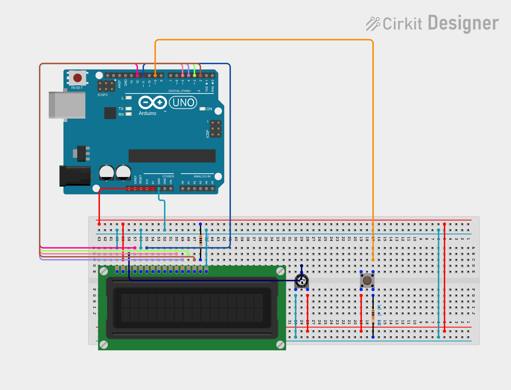
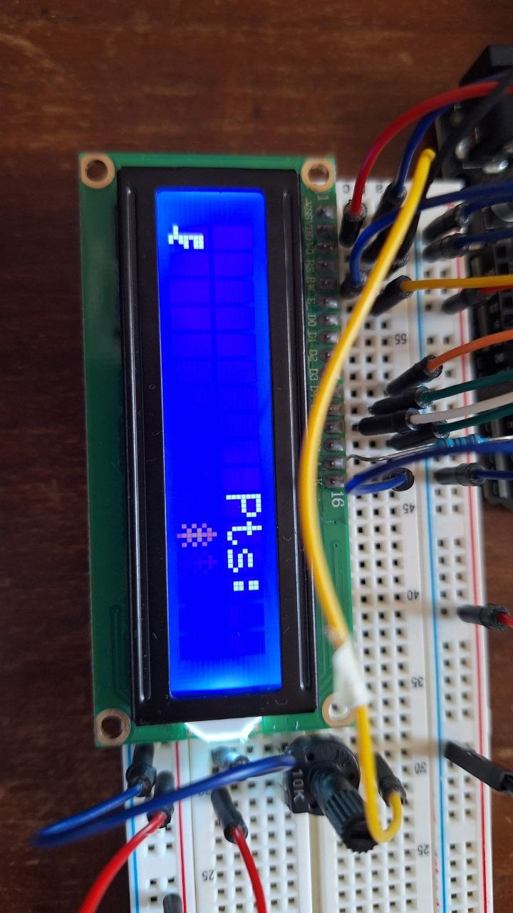
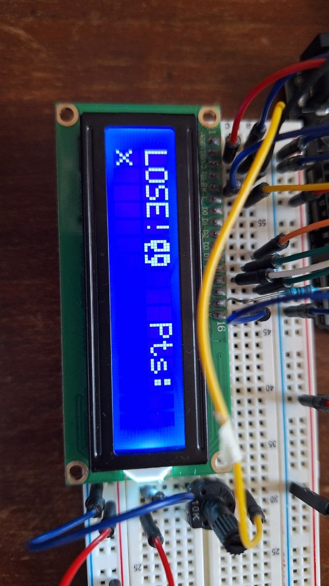

# DinoGame with Arduino 

A simple Arduino project that recreates Google's Dino Game, the dinosaur game in Chrome.

The game runs on a 16×2 LCD display: use a button to make the dinosaur jump over obstacles. Each obstacle cleared earns one point. Reach 10 points to win, or hit an obstacle and lose. After the win or loss screen, the score resets and the game starts again.

The project code is in [dinoGame.ino](dinoGame.ino) and uses the `LiquidCrystal` library to control the display.

## Photos and Video

The project's images and video are available in the [multimedia](multimedia/) folder:

### Circuit DesignS

[View and edit the interactive circuit in Cirkit Designer](https://app.cirkitdesigner.com/project/2570c88a-545e-40e6-91c6-fab211f9cc3a).

### Wiring Connections

The following connections match the circuit diagram above. LCD pin numbers refer to the display's 16-pin header.

| Component          | Pin or terminal                    | Connection                                                       |
| ------------------ | ---------------------------------- | ---------------------------------------------------------------- |
| Arduino Uno        | 5V                                 | Breadboard positive (+) power rail                               |
| Arduino Uno        | GND                                | Breadboard negative (−) power rail                               |
| Breadboard         | Upper and lower positive (+) rails | Connected together with a jumper                                 |
| Breadboard         | Upper and lower negative (−) rails | Connected together with a jumper                                 |
| LCD 16×2           | 1 — VSS (GND)                      | Negative (−) power rail                                          |
| LCD 16×2           | 2 — VDD (5V)                       | Positive (+) power rail                                          |
| LCD 16×2           | 3 — VO (contrast)                  | Potentiometer wiper (middle terminal)                            |
| LCD 16×2           | 4 — RS                             | Arduino D12                                                      |
| LCD 16×2           | 5 — R/W                            | Negative (−) power rail                                          |
| LCD 16×2           | 6 — E (enable)                     | Arduino D11                                                      |
| LCD 16×2           | 7–10 — DB0–DB3                     | Not connected (4-bit mode)                                       |
| LCD 16×2           | 11 — DB4                           | Arduino D5                                                       |
| LCD 16×2           | 12 — DB5                           | Arduino D4                                                       |
| LCD 16×2           | 13 — DB6                           | Arduino D3                                                       |
| LCD 16×2           | 14 — DB7                           | Arduino D2                                                       |
| LCD 16×2           | 15 — A (backlight +)               | Positive (+) power rail through the backlight resistor           |
| LCD 16×2           | 16 — K (backlight −)               | Negative (−) power rail                                          |
| Potentiometer      | Two outer terminals                | One to the positive (+) rail, the other to the negative (−) rail |
| Potentiometer      | Wiper (middle terminal)            | LCD pin 3 — VO                                                   |
| Push button        | One switched contact               | Positive (+) power rail                                          |
| Push button        | Other switched contact             | Arduino D9 and one end of the pull-down resistor                 |
| Pull-down resistor | Other end                          | Negative (−) power rail                                          |

The backlight resistor is connected between 5V and LCD pin 15. On the four-leg push button, use contacts that are connected only when the button is pressed.

**Code note:** The diagram uses an external pull-down resistor, so pressing the button sends `HIGH` to D9. The sketch currently configures D9 as `INPUT_PULLUP`; use `INPUT` for this wiring to avoid enabling the internal pull-up as well.

### Dino Screen

### Losing Screen

### Winning Screen

### Demo Video

<video controls width="640" src="multimedia/video_2026-09-24_12-19-59.mp4">
  Your viewer does not support embedded video playback.
</video>

[Watch the demo video](multimedia/video_2026-09-24_12-19-59.mp4)
